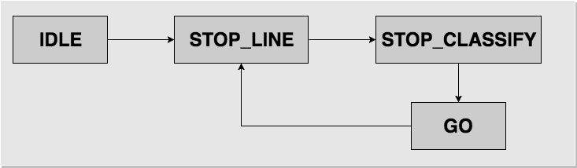
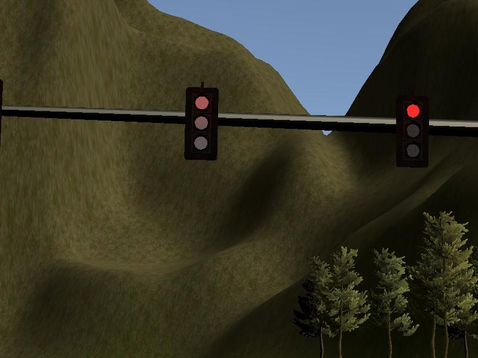
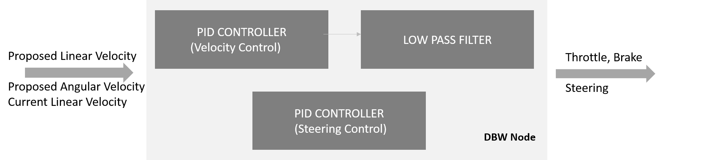

This is the project repo for the final project of the Udacity Self-Driving Car Nanodegree: Programming a Real Self-Driving Car. For more information about the project, see the project introduction [here](https://classroom.udacity.com/nanodegrees/nd013/parts/6047fe34-d93c-4f50-8336-b70ef10cb4b2/modules/e1a23b06-329a-4684-a717-ad476f0d8dff/lessons/462c933d-9f24-42d3-8bdc-a08a5fc866e4/concepts/5ab4b122-83e6-436d-850f-9f4d26627fd9).

### Overall project overview

This project is built on the Robot operating system ROS which has a node based architecture, the different nodes can communicate with each other using messages. Each node can publish and/or subscribe to topics. When a node subscribes to a topic it receives all messages published to this topic.
This ROS implementation is composed of three main internal components and one external, which are:

#### Internal:
- The perception Component: responsible for detecting the traffic lights and obstacles on the road and where they are
- The Planning component: responsible for planning where the car should drive and in what velocity and where it
 Should stop based on the current car position and the traffic lights positions perceived in the perception component
- The Control Component: responsible for executing the planned path and velocity received from the planning component.

#### External:
There is also an external component which is the car/simulator. This publishes to two topics:
- **The image_color topic**:  this delivers a stream of images taken by the car camera in real time. These images are used by the perception component to detect traffic lights and obstacles positions.
- **current_pose topic**:  this delivers information about the car current position.

Here is a graph showing the whole system architecture and how its parts communicate with each other:

In the following, each of these Components/nodes will be explained in more details.

### Perception - the Traffic light detector

The traffic detection ROS node's purpose is to provide obstacle information to the planning node. In this project, traffic lights are the first obstacle that we focus on.

The traffic detector node achieves this by subscribing to three topics:

* **/base_waypoints** provides the complete list of waypoints for the course. and are received only once.
* **/current_pose** can be used used to determine the vehicle's current location.
* **/image_color** which provides an image stream from the car's camera. These images are used to determine the color of upcoming traffic lights.

The node then publishes the index of the waypoint for the nearest upcoming red light's stop line to a single topic: **/traffic_waypoint**

This index will be later consumed by the Planning node to set the target velocity for this waypoint index to 0 and smoothly decrease the vehicle velocity in the waypoints leading up to this index.

We incorporated a Finite State Machine (FSM) into this node. The FSM is driven by the frequency of **image_cb** -- a callback function for incoming images from the car's camera. (the publisher lives in *server.py*)

Initially, the FSM is in **IDLE** state, and moves on to **STOP_LINE** state upon receiving the first image message and if the traffic light array containing traffic light waypoints has been received. During this state transition we initialize the traffic light classifier.

In the **STOP_LINE** we are ready to classify incoming images. As a first classification approach we choose a very conservative one, i.e., only when the car comes to a full stop (which can be determined by observing the vehicle's current pose), we classify the camera image. Fixing the view point and distance to the traffic light increases the quality of the classification and eases the control of the car approaching a traffic light - since we always have to come to a stop in front of a traffic light. and then we start classification.

In the **STOP_LINE** we constantly publish the waypoint index of the stopline in front of the next traffic light.

Once we come to a full halt, we move on to **STOP_CLASSIFY** state. Based on the result of the traffic light classification we stay in this state as long as the light is red. Once it is detected as not red, we leave this state and transition into **GO** state.

In **GO** we signal the car (by publishing a -1 traffic_waypoint) that the light switched from red and the car can accelerate.
Once we detect in this state that the car is moving, we transition into **STOP_LINE** state and wait until the car stops at the next stopline in front of a traffic light.

This summarizes the simple FSM in the traffic light detection node, which is driven my car image messages:

Note, that it is very crucial to avoid any time delays between detecting "not red" on the traffic light and publishing the "GO" message to the planner.

Next, we describe the classification process in more detail:

### Traffic classifier

Traffic classifier code is used which was used in Udacity AI nano-degree course and by Vulture team.
(in Traffic classifier/gan_semi_supervised_kb.ipynb)

Number of epochs was set to 55, as the trade-off when the classifier accuracy on the test set starts to diminish (while the accuracy on the testing set still increases - therefore representing when the classifier starts to overfit the data.)

Overall 5 models were trained and the best model retained.

### Planning - Waypoint Updater

The waypoint updater node takes the car's current pose and waypoint information, to compute and publish the future set of final waypoints which the car's drive by wire (dbw) system can follow.

Before the waypoint updater can start, it needs to receive the base_waypoints -- the set of points which describes the path on the road which the car should follow.  For the simulator, the base_waypoints describes a loop around the test road. The initial base_waypoints also contains a set of vehicle velocities which can be used to initially test the waypoint updater, however, for the complete waypoint updater, those values will be recomputed.  

When the waypoint updater node first receives the base_waypoints, it resets all of the velocities to a minimum since it doesn't necessarily know the current car pose and consequently closest waypoint.  It must also accelerate the vehicle from a standstill. Since the car's starting position in the simulator is relatively close to a traffic light, it could actually receive an upcoming traffic waypoint while it's still accelerating from a standstill.  If the car responds to these traffic waypoints and starts to slow down too early, it will "crawl" until it reaches the first traffic light.  On the other hand, if the waypoint updater allows the car to reach its cruise velocity (about 24mph in the simulator), it will not have enough  time to slow down.  Consequently, the waypoint updater goes through an initialiaization state where it will ignore traffic waypoints.  Once it reaches an initial velocity of about 1/6 the cruise velocity, it will then go into normal mode and respond to traffic waypoint messages.

When the waypoint updater receives the current car pose, it must first calculate the closest waypoint.  To do this efficiently, if it previously computed a closest waypoint, it will use that as a starting point and search around that; otherwise it will search the entire list of base_waypoints.  Once it computes a candidate for closest waypoint, it compares the directional vector from the car's current position to that waypoint versus the car's current orientation (yaw) in order to determine if the waypoint is in front or in back of the car.  If the waypoint is behind the car, it will increment the waypoint by one.  If by chance, the waypoint matches the current car location, it will increment it again so that the car can move forward.

Once the waypoint updater finds the next closest waypoint to follow, it checks to see if there is an upcoming traffic waypoint.  If there is no traffic waypoint, it will take the closest waypoint's velocity and for the next LOOKAHEAD_WPS number of waypoints calculate the appropriate velocities such that it either accelerates to the cruise velocity or stays at the cruise velocity.  If there is an upcoming traffic waypoint, however, it will calculate how far it is from its stopping point and how long it would take to stop using maximum deceleration.  If there is sufficient margin, it will continue to cruise at its current velocity; otherwise it will calculate a trajectory where it slows down.

For both accelerating and decelerating, the waypoint updater uses the distance between two waypoints and the simple kinematic equation: *Vf 2* = *Vi 2* + *2&middot;a&middot;s*, where :

* *Vf* : next waypoint velocity
* *Vi* : current waypoint velocity
* *a*  : acceleration or deceleration where acceleration is > 0 and deceleration < 0
* *s*  : distance between waypoints

When the waypoint updater receives a traffic waypoint, it also performs some checks to ensure that it is valid.  If the traffic waypoint is behind the car or outside of it's projected trajectory, then it will ignore it.  If the traffic waypoint is -1 and it's stopped at a traffic waypoint, then it clears its current traffic waypoint and can start accelerating to its target cruise velocity once again.

In the simulator, the base_waypoints forms a loop around the test road.  To support looping around the track, modular arithmetic is used when dealing with waypoint indices.  For example if there are NUM_WAYPOINTS which are indexed from 0 to NUM_WAYPOINTS-1, NUM_WAYPOINTS and NUM_WAYPOINTS+1 will map back to index 0 and 1 respectively.

### Controller - Drive by Wire 

# 

In order to develop the drive by wire node, there were a variety of controllers that were used in the
twist_controller.py. These are the following:

- First is the PID controller which is used to correct for velocity error. Default implementation
provided by Udacity worked very well for this task, so they were used.
- The second is the Low pass filter which is applied on top of the velocity corrections from the PID
controller.
- The third is another PID controller which is used to control the Steering. Default implementation
provided by Udacity worked very well for this task, so they were used.

All these controllers are applied in the control function in the twist controller. The biggest challenge in
implementing the Drive by wire node was to find the right parameters for the PID controller. It took
quite a few iterations on empirical analysis to find the right parameters for the controller. The second
challenge which caused the bulk of delay was the “default” queue sizes and rate at which messages are
published by various ros nodes in the provided code-base. Suggestions on the forum helped quite a lot
in finding the right values for this. Once the right queue sizes were identified, developing the drive by
wire node took only a little time.
